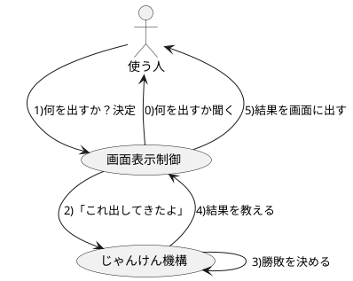
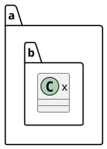

# じゃんけんゲーム

# URL

https://eng-entrance.com/java-game-janken-switch

# アプリケーションの仕様を書き出して、作るものを明確にする

## なぜ必要か？

* 何を作るのか？を **自分自身が** 明確に理解する必要がある
* 明確にすると、他人との認識のずれを防ぐことができる
* (結果的に、)仕様自体の問題/不足点をあぶりだせる可能性もある

## 書いてみた

* コンソール上で動くプログラムである
* 流れ
  1. 何を出すか？を聞かれる
  1. キーボード入力で何を出すか決める
  1. 相手が何を出したか？と自分が何を選択したか？を表示し
  1. 勝敗結果が表示される
  1. 最初に戻る
  
## こんなところに注目しよう

* 仕様中に曖昧になっている表現は無いか？
  * ex) 「何を出すか」決める ⇒ それって具体的に何？
  * **きっとそう思ってるだろう** みたいな思い込みに依存してしまってないか？
  * 改善案1) 「選択肢は"グー, パー, チョキ"とし、選択式とする」
  * 改善案2) 「入力は"グー, パー, チョキ"のみを有効値とする」
* 「そうじゃなかったらどうなる？」と考えてみる
  * 「キーボードで入力」
  * ⇒ 何も入力しなかったら？"/"とか"1"みたいなのが入力されたら？
    
# どんな機能が必要か？を考える

## こう考えてみた

* じゃんけんの仕組み自体を作る部分と、画面の表示/入力を管理する部分は分けて考えてみる
* 表示方法は変わるかも可能性もあるが「じゃんけん自体の機能は変わらないもの」と思えるので

# 各機能を作るために必要なクラスを考える

* 考えかた
  * "そのクラスは何を知ってるのか？"
  * 何を知っていない(知らないべき)か

